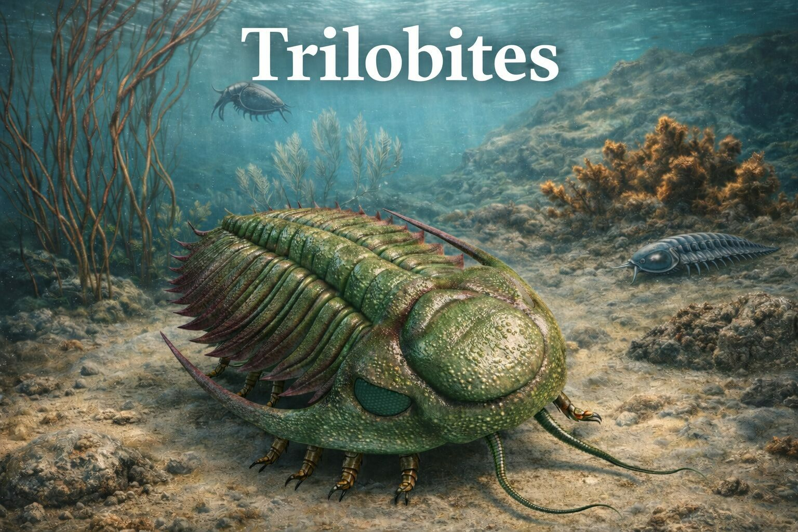

# Predict the Age of a Trilobite Fossil (Machine Learning Project)

  

---

## 🚀 Live Demo

  

> An interactive multi-tab dashboard built with Streamlit — explore EDA visualizations, model results, clustering analysis, and age prediction insights across all four machine learning tasks.

---

## Overview

This project explores how machine learning can be applied to paleontological data to analyze trilobite fossils and uncover patterns related to their age, distribution, and environment.

Multiple models were developed to solve different tasks using the same dataset.

---

## What Were Trilobites?

Trilobites were ancient marine arthropods that lived hundreds of millions of years ago.

- **First Appearance:** ~521 million years ago (Cambrian)  
- **Extinction:** ~251 million years ago (Permian extinction)  
- **Habitat:** Marine environments  
- **Diet:** Predators, scavengers, filter feeders  

---

## Dataset Overview

- **Total Records:** 29,039  
- **Global Coverage:** Multiple countries and geological formations  

### Key Features:

| Category  | Examples                          |
|-----------|-----------------------------------|
| Taxonomy  | order, family, genus              |
| Geography | country, latitude, longitude      |
| Ecology   | environment, diet, vision         |
| Geology   | lithology, formation              |
| Time      | time_period                       |

---

## Machine Learning Tasks

The project includes four main tasks:

---

### 1. Time Period Classification

**Goal:**  
Classify fossils into their correct geological time period (e.g., Cambrian, Ordovician, Silurian, Devonian, Carboniferous, Permian).

To better understand the impact of features, two versions of the model were built:

#### Model A — With Taxonomy Features
Includes all features such as genus, family, and order.

| Model         | Accuracy |
|---------------|----------|
| Decision Tree | 97.7%    |
| Random Forest | **98.5%**|

#### Model B — Without Taxonomy Features
Removes genus, family, and order to test environmental and geographical signals alone.

| Model         | Accuracy |
|---------------|----------|
| Decision Tree | 96.5%    |
| Random Forest | **97.4%**|

**Insight:**  
Taxonomic features significantly improve model performance. However, even without these features, the model still achieves strong accuracy, indicating that environmental and geographical features also contribute meaningfully to prediction.

---

### 2. Continent Classification Model

**Goal:**  
Predict the continent where a trilobite fossil was found based on geological, biological, and environmental features.

**Approach:**  
The data was preprocessed by converting categorical features (such as `time_period`) into numerical format using one-hot encoding. Country codes were mapped into 7 continental regions, and the target variable was defined as the continent label.

Three machine learning models were trained and compared:

| Model               | Accuracy | F1 Score (weighted) |
|---------------------|----------|----------------------|
| Random Forest       | 89%      | 0.89                 |
| XGBoost             | **96%**  | **0.96**             |
| Logistic Regression | 90%      | 0.90                 |

**Insight:**  
XGBoost achieved the best performance, showing strong generalization across all continents. Logistic Regression also performed well, indicating that the dataset contains clear patterns that are relatively easy to separate linearly. Random Forest performed slightly lower, especially on underrepresented classes such as Africa and Oceania.

Additionally, class imbalance (e.g., very few samples for Antarctica) affected the performance of some models on minority classes.

---

### 3. Age Prediction

**Goal:**  
Predict the average geological age of a trilobite fossil (in millions of years ago, Mya) using biological, geographical, and geological features — without relying on direct time-related leakage columns.

**Approach:**  

1. **Target variable:** `avg_age` — engineered as the mean of `max_age_mya` and `min_age_mya`, then these two source columns were dropped to prevent leakage.  
2. **Feature pruning:** All `early_interval_*`, `family_*`, and `order_*` one-hot columns were removed before modeling to reduce noise and leakage risk, leaving a starting feature space of 2,423 columns.  
3. **Feature selection pipeline:** Four independent methods were applied on the training split only:
   - **SelectKBest** (F-regression scores)
   - **Mutual Information Regression**
   - **Random Forest Feature Importance**
   - **Recursive Feature Elimination (RFE)**  

   Features selected by **at least 2 out of 4 methods** were retained — yielding **59 final features**.  

4. **Models trained and evaluated:**

| Model               | MAE (Mya) | RMSE (Mya) | R²         |
|---------------------|-----------|------------|------------|
| Linear Regression   | 25.84     | 36.51      | 0.4402     |
| XGBoost             | 6.40      | 12.63      | 0.9330     |
| SVR                 | 6.68      | 17.46      | 0.8720     |
| Extra Trees         | 2.95      | 12.45      | 0.9349     |
| **Random Forest**   | **3.18**  | **11.28**  | **0.9466** |

**Best Model: Random Forest** — highest R² of **0.9466**, meaning it explains ~94.7% of the variance in fossil age using only indirect biological and environmental signals.

**Insight:**  
Linear Regression performs poorly (R² = 0.44), confirming that the relationship between the selected features and fossil age is highly non-linear. Tree-based ensemble methods (Random Forest, Extra Trees) capture this complexity well. Extra Trees achieves a slightly lower MAE (2.95 vs 3.18) but Random Forest leads on R², making it the best overall model. The strong performance without any direct time-interval features confirms that geography, ecology, and rock type carry genuine temporal signal.

---

### 4. Clustering

**Goal:**  
Discover natural groupings in the trilobite fossil record without any predefined labels — identifying biogeographic provinces and evolutionary lineages purely from numerical features.

**Approach:**  

1. **Data preparation:** Rows with any missing values were dropped, leaving **722 complete records**. Five numerical features were used: `genus_num`, `max_age_mya`, `min_age_mya`, `longitude`, `latitude`. All features were standardized with `StandardScaler`.  

2. **Finding optimal k:** K-Means was run for k = 2 to 10. Three metrics were computed per k:
   - **Elbow Method** (inertia)
   - **Silhouette Score** → maximized at **k = 10** (score: **0.617**)
   - **Davies-Bouldin Index** (lower is better)

3. **K-Means clustering** was applied with the optimal **k = 10**.  

4. **PCA** (2 components) was used to visualize clusters — explaining **67.3%** of variance (PC1: 45.1%, PC2: 22.2%).  

5. **Cluster evaluation:** Silhouette plot, cluster size distribution, cluster center heatmaps (raw and standardized Z-scores).

**Cluster distribution:**

| Cluster | Size | % of Data |
|---------|------|-----------|
| 0       | 172  | 23.8%     |
| 1       | 128  | 17.7%     |
| 2       | 36   | 5.0%      |
| 3       | 7    | 1.0%      |
| 4       | 32   | 4.4%      |
| 5       | 43   | 6.0%      |
| 6       | 237  | **32.8%** |
| 7       | 23   | 3.2%      |
| 8       | 20   | 2.8%      |
| 9       | 24   | 3.3%      |

**Geological interpretation of clusters:**

- **Clusters 2 & 5 — Cambrian Giants:** Oldest and most diverse. Located around longitude 108°, latitude 28° (South China Plate). Cluster 2's high genus_num (~182k) suggests a Lagerstätte site like the Chengjiang Biota.  
- **Cluster 4 — Gondwana Cambrian:** ~490 Mya, South American Gondwana province (longitude –65, latitude –24).  
- **Clusters 0 & 6 — Ordovician Peak:** Northern Hemisphere dominance (Laurentia and Baltica). Cluster 6 is the largest group (n=237), reflecting Mid-Ordovician ~454 Mya abundance.  
- **Cluster 1 — N. America Late Ordovician:** Tight grouping around longitude –83, latitude 49 (Great Lakes / Appalachian region).  
- **Cluster 7 — Australia / Tasmania:** Southern Hemisphere isolate (longitude 145, latitude –41) with high age-span variance — a long evolutionary sequence in a stable environment.  
- **Cluster 3 — Permian Survivors:** Youngest age (~276 Mya), smallest group (n=7). The last trilobite lineages before the Permian extinction.  
- **Clusters 8 & 9 — Taxonomic Outliers:** Cluster 8 has an extremely high genus_num (~371k), likely a data artifact or a highly widespread European genus.

**Insight:**  
K-Means at k=10 cleanly separates biogeographic provinces that correspond to known paleontological boundaries — without using any time or location labels during training. The clustering confirms that geographic position and geological age together form a strong natural signal in this dataset.

---

## Key Insights

- Biological features are strongly correlated with geological time periods  
- Environmental factors help explain fossil distribution  
- Removing time-related features prevented data leakage  
- The dataset contains class imbalance (e.g., fewer Permian and Antarctica samples)  
- Tree-based ensemble methods consistently outperform linear models on this dataset  
- Geographic and ecological signals alone can predict fossil age with ~94.7% explained variance  

---

## Challenges

- Imbalanced dataset across time periods and continents  
- Potential data leakage from time-interval columns  
- High-dimensional feature space after one-hot encoding (~2,800+ columns)  
- Missing values concentrated in specific columns (e.g., `late_interval`: 91% missing)  

---

## Conclusion

This project demonstrates how machine learning can be used to analyze fossil data and uncover patterns about ancient life on Earth. From classifying geological eras to predicting fossil ages across 500 million years of history, the models show that biological, geographical, and ecological signals carry rich temporal and spatial information — even in an inherently noisy paleontological dataset.

---

## Future Work

- ~~Build an interactive dashboard~~ ✅ Done — [Live on Streamlit](https://machine-learning-project-rnczamy3pk4daonn663veu.streamlit.app/)  
- ~~Deploy models~~ ✅ Done  
- Extend to deep learning approaches for age regression  
- Add geographic map visualizations of fossil distribution  

---

## Project Highlights

- Multiple machine learning tasks on a single real-world dataset  
- Real scientific paleontological data  
- Rigorous preprocessing and data leakage prevention  
- Multi-method feature selection pipeline  
- Model comparison and evaluation across regression and classification tasks  
- Interactive Streamlit dashboard with 6 tabs  

---

## Dataset

[Kaggle — Predict the Trilobite Fossil Age](https://www.kaggle.com/datasets/kayleefranklin/predict-the-trilobite-fossil-age)

---

## Contributors
- Faisal Alsulami
- Lana Aljuaid
- Alaa Alshahranni
- Abdullah Alkhurayjah  

  Built with a focus on data analysis and machine learning

